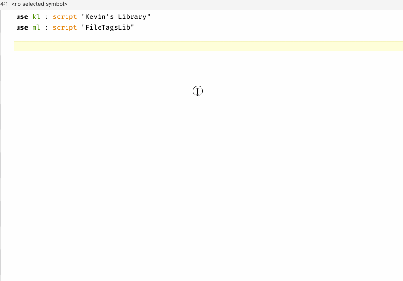

# Jump to Script Debugger handlers
 Alfred workflow that allows you to search through the handlers of the used script libraries of the front script of Script Debugger, then insert a dynamically made clipping of the chosen handler within the script.

  

